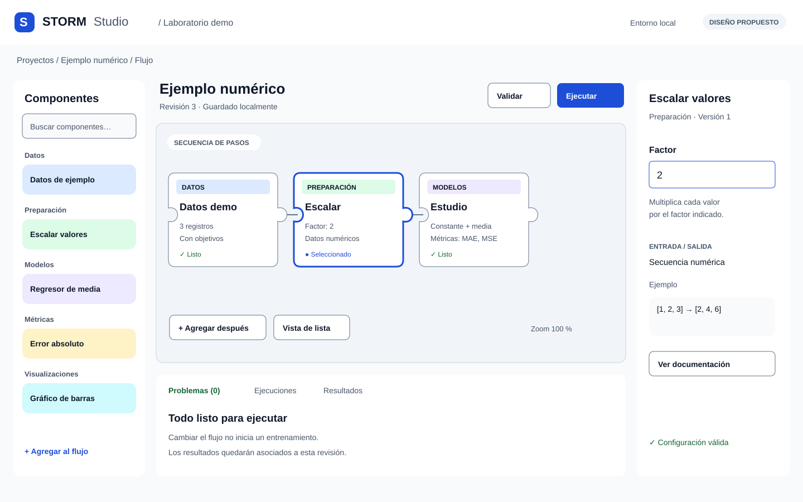
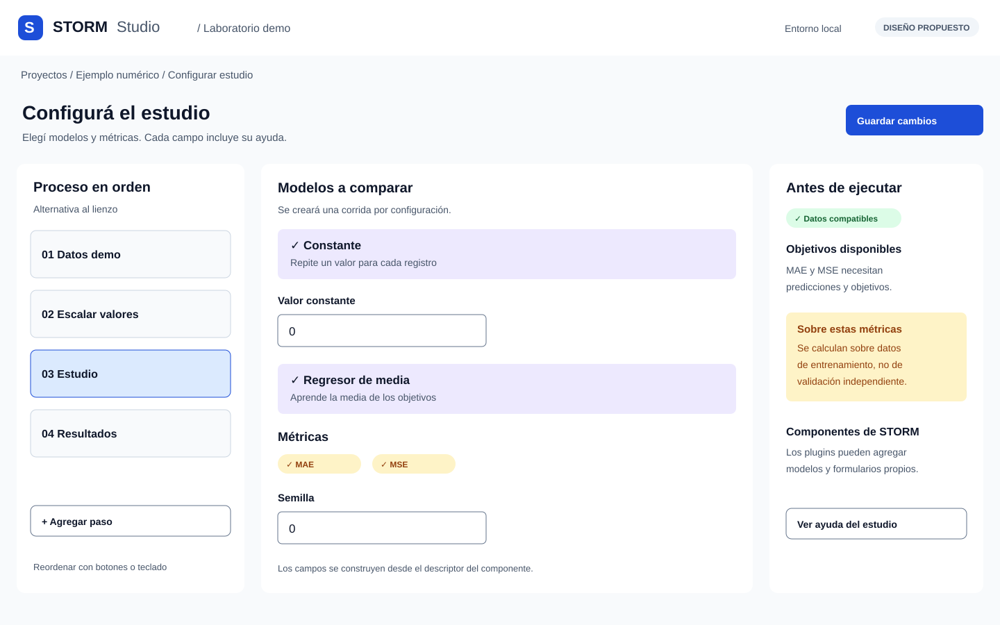
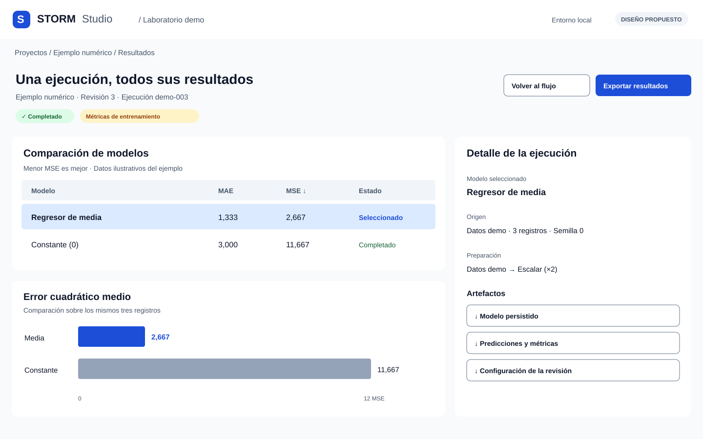
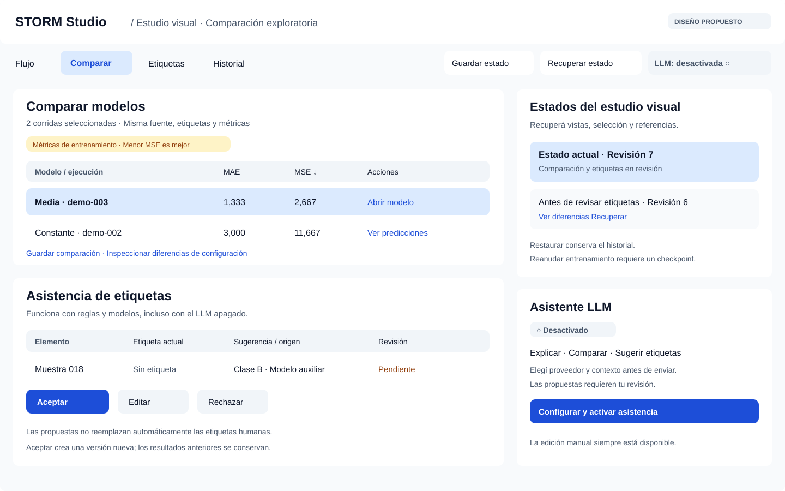
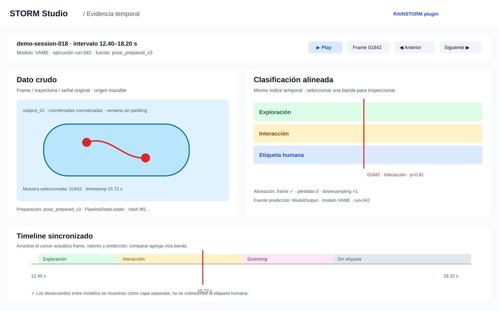
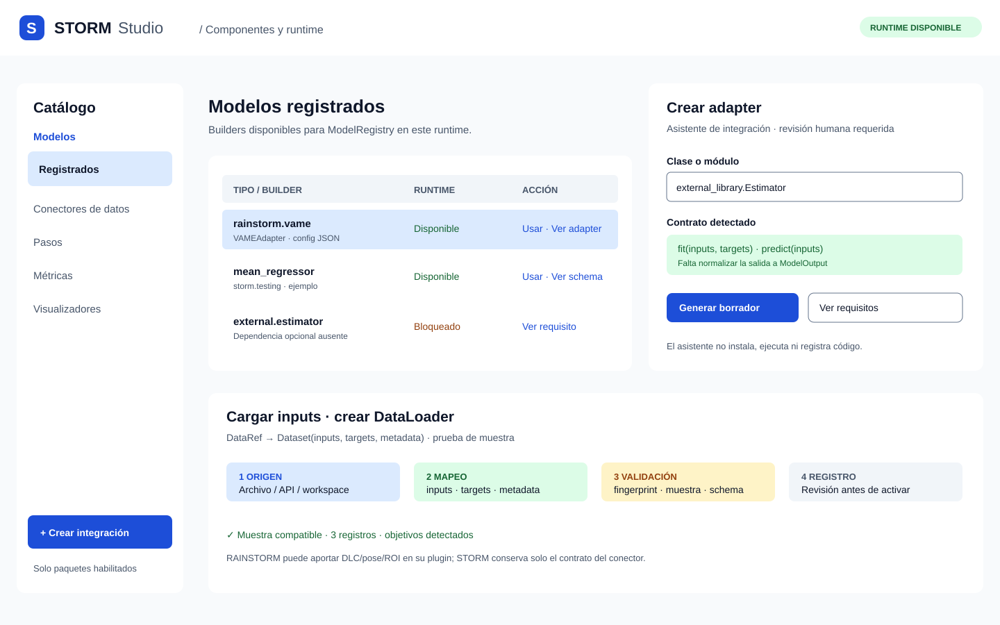

# Mockups editables de STORM Studio

Estado: propuesta visual, no aplicación funcional. Tamaño de cada pantalla:
1440 × 900 px. Los datos y estados mostrados son ilustrativos.

## Editor de flujos

Catálogo, piezas con encastres, configuración lateral y seguimiento del proceso.

[Abrir o descargar SVG editable del editor](../assets/mockups/editor.svg).

## Configuración de componentes

Formularios de modelos y métricas, ayuda contextual y alternativa al lienzo
mediante una lista ordenada. Representa el formulario generado por descriptores.

[Abrir o descargar SVG editable de configuración](../assets/mockups/configuracion.svg).

## Resultados

Comparación de corridas, selección, gráfico y acceso a artefactos. Las métricas
están identificadas como métricas de entrenamiento, siguiendo la API actual.

[Abrir o descargar SVG editable de resultados](../assets/mockups/resultados.svg).

## Estudio visual

El espacio de trabajo integra comparación de modelos, recuperación de estados,
asistencia de etiquetas y activación opcional de LLM. Estas funciones pertenecen
al estudio visual y se mantienen separadas del plan ejecutable.

[SVG editable](../assets/mockups/estudio-visual.svg) ·
[Diseño y comportamiento](visual-study.md).

## Evidencia cruda y clasificación

La vista específica para modelos de comportamiento superpone la clasificación
con el dato original y un timeline común. Es una extensión de visualización de
RAINSTORM construida sobre `VisualizationRequest`, no una lectura de DLC o pose
en el núcleo de STORM.

[SVG editable](../assets/mockups/raw-classification.svg) ·
[Contrato y reglas](visual-study.md#inspeccion-de-datos-crudos-y-clasificacion).

## Componentes y runtime

Este mockup muestra cómo exponer los componentes que ya registra STORM, crear
adapters para código externo y recorrer el asistente de carga de inputs.

[SVG editable de componentes y runtime](../assets/mockups/componentes-runtime.svg) ·
[Guía de componentes](../guides/studio-components.md).

## Edición de los archivos

Los SVG son los archivos fuente: contienen textos, rectángulos, conexiones y
piezas vectoriales independientes, sin capturas incrustadas. Usan Arial con
fallback sans-serif; instalar una fuente distinta puede cambiar el ancho del texto.

- **Inkscape:** abrir el SVG; los grupos principales están etiquetados como
  capas. Seleccionar una capa o entrar al grupo para modificar textos y formas.
- **Figma u otro editor vectorial:** importar el SVG y desagrupar si es necesario.
  La conservación de textos y capas depende del importador; los originales
  permanecen editables en SVG. No son archivos nativos `.fig` ni componentes
  con auto-layout.
- **Editor de texto:** modificar atributos `fill`, coordenadas y elementos
  `text`; los IDs de grupos identifican catálogo, lienzo, inspector y resultados.
- **Navegador:** abrir directamente para visualizar; no ofrece edición ni
  interacción funcional del flujo.

Conservar los originales y crear copias para variantes. Exportar PNG/PDF solo
para compartir una vista final, sin reemplazar los SVG editables. Los gráficos
de resultados también son formas editables.

Estas pantallas concretan la [guía de marca](studio-brand.md). Quedan pendientes
las variantes móviles, estados de error/cancelación y la personalización
RAINSTORM; se desarrollarán al validar este primer diseño con usuarios. El
[plan](../planning/studio-roadmap.md) sigue distinguiendo mockup de prototipo
interactivo y de implementación.
